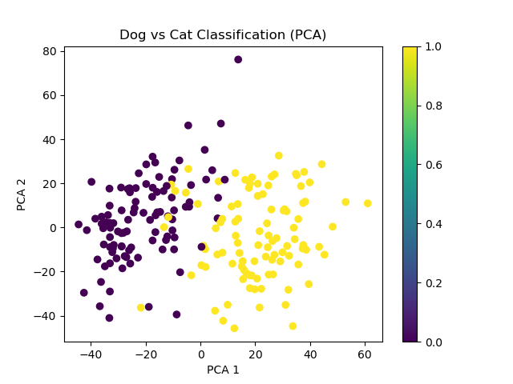

# 实验三SVM：Dogs v.s Cats Classification



## 1.数据集选取

在实验要求中提供的数据集网站里 [Top 23 Best Public Datasets for Practicing Machine Learning (rubikscode.net)](https://rubikscode.net/2021/07/19/top-23-best-public-datasets-for-practicing-machine-learning/) ，我选择了Cats vs Dogs数据集作为这次实验的数据集。选取这个数据集的原因是我一直对图像特征提取有兴趣，也想借此机会熟悉一下图片分类任务。猫、狗图片二分类任务可以说是图片分类任务中非常经典的例子，而且二分类任务也很适合使用SVM支持向量机的方法。

数据集下载地址： [Dogs vs. Cats | Kaggle](https://www.kaggle.com/c/dogs-vs-cats) 

## 2.数据集处理

数据集下载解压后的文件结构：

```
.
|__test1
|   |__test1	
|		|__1.jpg
|   	|__2.jpg
|		|__...
|
|__train
|	|__train
|		|__cat.1.jpg
|		|__...
|		|__cat.12499.jpg
|		|__dog.1.jpg
|		|__...
|		|__dog.12499.jpg
```


可见，该数据集保存图片的方式是直接保存jpg图片，而不是numpy数组的方式，因此，我们需要先通过imageio读入图片

**而且需要注意：该数据集的标注在图片名（dog.n.jpg/cat.m.jpg)；而test数据集没有标注，因此我们要拆分train数据集，将原本用于训练的数据集拆分为用于训练和用于验证的数据集。**

**说明**：

1. 由于需要多次尝试训练（debug),不希望每次训练都加载一次数据集，因此我采用了一个标志位，当标志位is_npy=0时表示第一次加载数据集，# 并且将数据集加载生成的numpy数组保存为.npy文件；后续debug，多次训练时可以直接置标志位为1.直接load对应的.npy文件
2. 这里只加载了原数据集中猫、狗各100张图片进行训练，原因有两点：
   1. 经过实验，电脑内存不支持加载全部的数据集，且加载的耗时很长
   2. **由于SVM的特性，最终fit的结果只与支持向量相关，除支持向量外其他的数据其实是没有用的**。**这也就是说，只要我在后续特征提取步骤做的足够好，能够将猫、狗的图片在特征向量空间中“分开”，那么就不需要大量的数据**。事实上，的确如此，在结果处我们可以看到只用100张图片仍然能够取得很好的精确率、回召率的结果。

3. 由于数据集的图片像素尺寸不一，在加载时统一resize为224*224，便于后续扔到CNN中做特征提取

加载数据集的代码：

```python
from skimage.io import imread
from skimage.transform import resize

def load_dataset(path, is_npy=False):
        if is_npy:
        	# 由于需要多次尝试训练（debug),不希望每次训练都加载一次数据集，因此我采用了一个标志位，当标志位is_npy=0时表示第一次加载数据集，# 并且将数据集加载生成的numpy数组保存为.npy文件，后续debug，多次训练时可以直接置标志位为1.直接load对应的.npy文件
         	train_data = np.load(os.path.join(dataset_path, "train_data.npy"))
       		# ... 
        	return train_data, train_label, validation_data, validation_label
    dataset_path = os.path.join(path, "train")
    save_path = os.path.join(path, "saved_data")
    """load"""
    train_data = []
    labels_train = []   # cat:0; dog:1
    # cat:12500 dog:12500
    """自己拆分数据集.这里只加载了100张图片，原因见下"""
    # 80%: for training 20% for validation
    print("loading training data ...")
    loop = tqdm.tqdm(range(0, 100))
    for i in range(0, 100):
        dog_img_name = "dog."+str(i)+".jpg"
        cat_img_name = "cat."+str(i)+".jpg"
        dog_img = imread(os.path.join(dataset_path, dog_img_name))
        cat_img = imread(os.path.join(dataset_path, cat_img_name))
        dog_img = resize(dog_img, (224, 224))
        cat_img = resize(cat_img, (224, 224))
        train_data.append(dog_img)
        train_data.append(cat_img)
        labels_train.append(1)
        labels_train.append(0)
        loop.update()
    train_data = np.array(train_data)
    labels_train = np.array(labels_train)

    print("saving data ...")
    np.save(os.path.join(save_path, "train_data.npy"), train_data)
    np.save(os.path.join(save_path, "train_label.npy"), labels_train)       
    
    # validation 数据集的加载同理
```

## 3.特征提取

### 3.1 ResNet18 提取图片特征

采用`torchvision.models.resnet18`的预训练的ResNet18网络进行图片特征提取的任务。

为了加快特征提取的速度，利用GPU进行并行加速

```python
# 加载预训练模型
model = torchvision.models.resnet18(pretrained=True)
# numpy ndarray -> tensor
train_data = torch.tensor(train_data, dtype=torch.float32)
# use gpu
if torch.cuda.is_available() == True:
      model = model.cuda()
      train_data = train_data.cuda()
train_features = model(train_data)
# gpu to cpu
if torch.cuda.is_available() == True:
      train_features = train_features.cpu().detach().numpy()

```

通过打印`shape`属性，**得知提取特征后每个图片的维度为1000维**


### 3.2 matplotlib可视化

经过卷积神经网络提取出来的特征向量有1000维，于是为了绘制散点图实现可视化，我们必须将其降维。

**注：降维只在可视化进行，目的是画图，构建SVM时仍在1000维空间。**

#### 3.2.1 PCA降维

这里直接利用`sklearn.decomposition.PCA`进行降维

代码如下：

```python
pca = PCA(n_components=2)
features_pca = pca.fit_transform(features)
```

#### 3.2.2 绘制散点图

利用`matplotlib`绘制散点图，代码如下

```python
plt.scatter(features_pca[:, 0], features_pca[:, 1], c=labels)	# scatter
# label at x axis
plt.xlabel("PCA 1")
# label at y axis
plt.ylabel("PCA 2")
plt.title("Dog vs Cat Classification (PCA)")
plt.colorbar()
# save picture
plt.savefig("./scatter.png")
```

效果已经展示在报告开头了

## 4.SVM

### 4.1 SVM原理

对于一个二分类任务，给定样本数据集，如果样本数据集能够在欧式空间中被表达（可能通过embedding或 feature extracting等手段），那么一个自然的想法就是基于样本集在样本空间中选取一个超平面。超平面将空间一分为二，完成二分类任务。

可能选取的超平面有很多，我们希望找到其中鲁棒性最强的一个，即泛化能力最强的一个。

超平面可用线性方程表达：
$$
w^Tx+b=0
$$
样本空间点$x$到平面的距离可以被表达为：
$$
r = \frac{|w^Tx+b|}{||w||}
$$
定义支持向量：距离超平面最近的几个训练样本点。

因此超平面的鲁棒性可以被表达为：两个异类支持向量到超平面的距离之和。

通过合适地选择w,b我们可以假设样本集满足以下约束：
$$
\begin{cases}
w^Tx_i+b \geq +1, \ \ y_i=+1; \\
w^Tx_i+b \leq -1, \ \ y_i=-1.
\end{cases}
$$
**则问题转换为凸优化问题**：
$$
min \frac{2}{||w||}
$$


### 4.2 fit

直接调用用`sklearn.svm`库

```python
"""构建SVM"""
clf = svm.SVC(kernel='linear', C=1, decision_function_shape='ovr')
"""train"""
clf.fit(train_features, train_labels)
```

### 4.3 predict

调用`sklearn.metrics.accuracy_score, recall_score, precision_score`库分别计算准确率、精确率、召回率，结果见5

下图源网络，仅借用说明：

  

## 5.结果

准确率、精确率、召回率如下：

1. Accuracy:0.98
2. Precsion_score:1.0
3. Recall score:0.96


仅仅使用了200/25000张图片就能达到不错的结果，我认为可以归功于：

1. SVM分类算法的特性，即在二分类的任务中只要样本数据在特征空间中的分布有明显的差异，则不需要太多的训练样本就能达到不错的分类效果
2. ResNet18虽然模型不算大，但在图片特征提取的效果已经很不错了，能够将猫。狗图片基本准确地分成两类，即使经过PCA降至2维，见实验报告开头的图片，仍然能够看出明显的差别。

